# Chapter Contents
{:.no_toc}

* TOC placeholder
{:toc}

# Citations, Bibliographies, and More
Zotero allows you to create citations and bibliographies from items in your library. Your option range from creating a bibliography on the fly, simply using drag & drop to sophisticated citations including ibid, supra notes, disambiguation etc. using word processor plugins. Zotero also provides you with options to view your items as reports or analyze them using a timeline or text-mining tools. 


## The Quick Way: Citations directly from Zotero
To create a bibliography for one or multiple Zotero items, simply select them in the center pane of Zotero, right-click, and select "Create Bibliography from Items". You can select multiple items using ```ctrl+click``` (Windows & Linux) / ```cmd+click``` (Mac) to add individual items to a selection or ```shift+click``` to select a range of items. You can also right-click on any collection and select "Create Bibliography from Collection". In the window that opens

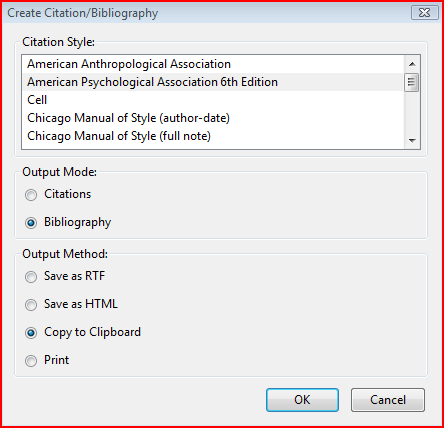 

select the desired citation style. In most cases you will use "Bibliography" as the **Output Mode** and "Copy to Clipboard" as the **Output Method**&mdash;more on that momentarily. Zotero will then copy a formatted bibliography for the selected items in the selected citation style to your clipboard and you can paste it anywhere you want, e.g. to your word-processor of choice. Now let's take a closer look at some of the other options. 

### Output Mode

Each Zotero citation style has a form for citations&mdash;what would appear in the text at the location you insert a citation&mdash;and (with very few exceptions) for the bibliography. "Create Bibliography" defaults, unsurprisingly, to creating bibliographies, but you can switch the **Output Mode** to Citation/Notes (which of the two options is displayed depends on the citation style). Most commonly you will use this to create a full note as it would appear in a footnote, e.g. according to the *Chicago Manual of Style*. For example, a note for a book using the citation style "Chicago Manual of Style (full note)" would look like this:

Robert L Heilbroner, *The Worldly Philosophers: The Great Economic Thinkers*, 3rd revised Edition (London: Penguin Press, 1969).

While its bibliography entry would be
			
Heilbroner, Robert L. *The Worldly Philosophers: The Great Economic Thinkers*. 3rd revised Edition. London: Penguin Press, 1969.	

Less typically, you can create in-text citations for such as (Heilbronner, 1969) by selecting "Citations" as **Output Mode** when using an author-date style such as "American Psychological Association 6th Edition". For numeric citation styles such as *Nature* or *IEEE* the "Citations" option is of little use, as it will just create numbers starting at 1. (For more on the different types of citation styles, see below). 

### Output Method
While copying to the clipboard is the most common output method, Zotero offers three other choices with distinct advantages.

* Using "Save as RTF" you can save the bibliography as an RTF (Rich Text Format) file that any word-processor can display. This option is particularly useful if you're using styles with complicated formatting requirements, which includes most annotated styles as well as style that list authors on separate lines in the bibliography, such as "American Anthropological Association". Such formatting will often be lost or look incorrectly when using the clipboard. When you save a bibliography to RTF, it will be directly 

* Using "Save as HTML" you can save the bibliography as an HTML file. You may wish to do this to include the bibliography in a webpage or in a blogpost, for example. What makes this particularly attractive is the fact that Zotero automatically embeds bibliographic information with the bibliography in COinS format. This way, anyone browsing the site using Zotero (as well as several other reference managers) will be able to import the items from the bibliography.

* Using "Print" will send the HTML version of the bibliography to Firefox's "print function.

## Quick Copy
Creating citations and bibliographies can be even simpler using **Quick Copy**, especially if you're mainly using one citation style. To use quick copy, first set a "Default Output Format" in the **Export** tab of the Zotero preferences.

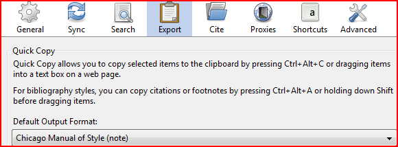 

When you drag & drop items from Zotero to any word-processor or text editor (e.g. to an e-mail you're writing in your email client or webmail), they will appear as bibliography entries in the selected default style. If you want them to appear in the citation/note form of the style, hold the ```Shift``` key during the operations. Instead of drag and drop, you can also use keyboard shortcuts to copy bibliographies or citations to the clipboard. ```ctrl+alt+c``` (```cmd+shift+c``` on Mac) copies bibliography for the selected items to the clipboard (i.e. works like simple drag&drop), ```ctrl+alt+a``` (```cmd+shift+a``` on Mac) copies the citations/notes for the selected items to the clipboard (analog to drag+```shift``` & drop). As for all items in your keyboard you can the paste wherever you want using right-click --> "Paste" or ```ctrl+v``` (```cmd+v``` on Mac). The quick copy functionality is not limited to bibliographic styles: You can also use translators, e.g. to quickly drag&drop records in BibTeX format. Translators are listed at the bottom of the "Default Output" selection list.

## Word processor plugins
Once you are writing a longer document, the "quick and dirty" way to create citations and bibliographies will likely not be enough. You want Zotero to keep track of the items you have cited already, you want to be able to switch citation styles, and you want Zotero to deal with pesky details like "ibid.", different rules for subsequent citations, etc. Zotero has developed plugins that allow you to interface with it while using *LibreOffice* (as well as the closely related *OpenOffice* and *NeoOffice*) as well as *Microsoft Word* for both Windows and Mac. 

### The Zotero word processor toolbar
After installing the word processor plugin, you will see a plugin bar with seven buttons

 

There is no toolbar in Mac Word 2008

<table>
	<tr class="row0">
		<th class="col0"> Zotero Insert Citation </th>
		<td class="col1">  </td>
		<td class="col2"> Insert a new citation in your document at the cursor location. </td>
	</tr>
	<tr class="row1">
		<th class="col0"> Zotero Edit Citation </th><td class="col1">  </td><td class="col2"> Edit an existing citation. You have to place the cursor inside the relevant citation before pressing this icon. </td>
	</tr>
	<tr class="row2">
		<th class="col0"> Zotero Insert Bibliography </th><td class="col1">  </td><td class="col2"> Insert a bibliography at the cursor location. </td>
	</tr>
	<tr class="row3">
		<th class="col0"> Zotero Edit Bibliography </th><td class="col1">  </td><td class="col2"> Edit an existing bibliography. </td>
	</tr>
	<tr class="row4">
		<th class="col0"> Zotero Refresh </th><td class="col1">  </td><td class="col2"> Refresh all citations and the bibliography, updating any item metadata that has changed in your Zotero library. </td>
	</tr>
	<tr class="row5">
		<th class="col0"> Zotero Set Doc Prefs </th><td class="col1">  </td><td class="col2"> Open the Document Preferences window, e.g. to change the citation style. </td>
	</tr>
	<tr class="row6">
		<th class="col0"> Zotero Remove Codes </th><td class="col1">  </td><td class="col2"> Remove Zotero field codes from the document. When Zotero inserts a citation or bibliography, it does so by using a field code. This field code allows Zotero to later recognize and automatically update the citation or bibliography (e.g., in numeric styles, citations have often to be renumbered when additional items are cited). Removing the Zotero field codes prevents any further automatic updates of the citations and bibliographies.<br/>
Note that removing field codes is <strong>irreversible</strong>, and should usually only be done in a near-final copy of your document. </td>
	</tr>
</table>

### Using the quick format bar
When you click the "Insert Citation" button for the first time in a document, Zotero opens the **Document Preferences**, where you can select the citation style you want to use in your document. You can change the citation style at any point later by clicking the "Set Document Preferences" button. We will discuss the document preferences in more detail below.

Once you have selected a citation style (and every subsequent time you click "Insert Citation") the **Quick-format** box, a red-rimmed search-box, opens. When you type into the box, Zotero runs a creator-title-year search of your libraries (that is your library and all groups you belong to) and displays the results.

 

Simply select a citation by clicking on it, then press ```Enter``` and Zotero will insert the correctly formatted citation into your document. When you use a note-based style, Zotero will create a footnote or endnote and include the required information. If you would like to insert multiple citations, such as (Smith, 1776; Marx, 1867), continue typing after selecting the first reference. Note that different from e.g. EndNote, Zotero will *not* merge adjacent citations. You need to insert them together. This also applies to numeric citations such as Vancouver style to create citations such as [1-3].

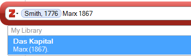 

Frequently you may want to add details to a citations, such as a comment before or after a citations or a page range such as (cf. Smith, 1776, pp. 45-48 for an early statement). In those cases click on the citation quick format bar to open a pop-up that allows you to enter that information in fields for "prefix", "suffix", "locators". We use "locator" to describe the various way the location of a reference within a work can be described. The most common locator and the default setting of the quick format bar is a page or a page range; other common locators are the chapter or the paragraph a citation can be found in.   

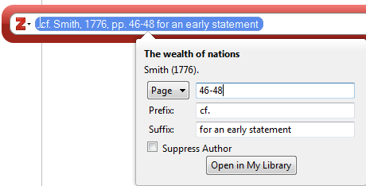

Citation details can be added for each item in a citation individually, so you can create complex citations such as (cf. Smith, 1776 pp. 46-48; and contrast with Marx, 1867, pp. 1-3) and even lengthy footnotes just using prefix and suffix. Why should you use the prefix/suffix fields to add information to citations rather than just adding it in your word processor? On every future occasion, when Zotero tries to update citations, e.g. when you change a citation style or if you have corrected item data in Zotero, it can automatically create the correct citation using the information in the prefix/suffix field. If, however, you have manually edited the citation (that is, used your word processor to directly add or delete parts of the citation) it is no longer able to do so. Instead, it throws a warning for each manually edited citation that you can either discard all your manual changes, or maintain the citation as is, which will prevent any further updates of that citation (citation style changes, data changes in Zotero, etc.). 


For author-date styles, a common form of citation includes the author's name in the text, followed by only the year (and, possibly, locators) in parentheses, e.g. "as Smith (1776) first pointed out". Zotero has the "Suppress Author" checkbox you can see in screenshot above. Type the name(s) of the author(s) ("Smith" in our example) in your word processor, then insert the citation and check the "Suppress Author" box to get "Smith (1776)". The logic behind this implementation is straightforward: Any part of the citation that is grammatically part of the sentence should by typed in the word processor.

Many author-date styles require items within a single citation to be sorted according to specific rules, typically either alphabetically or chronologically. Zotero rearranges citations you enter to automatically conform to these rules. On occasion, you may want to disable this feature for a citation to maintain the order of items and prevent automatic sorting. To do so, click on the small arrow at the left of the quick format bar and unselect "Keep Sources Cited".

 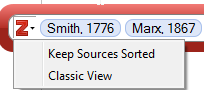


### Keyboard Shortcuts in Quick Format
A key design concept of the quick format bar is to allow you to use it without ever lifting your hands off the keyboard. As a first step, set-up keyboard shortcuts for your word processor. In Word for Mac, you can already see the shortcuts listed next to the respective commands in the Apple Script Menu. In Word for Windows .... In LibreOffice...
Once you have opened the **Quick Format** bar, search for the item you want to cite as above. You can navigate among the search results using the up and down arrows. To select an item, press ```enter``` when it is highlighted. Instead of clicking on the item in the quick format bar, you can access the details view to enter locators and affixes by pressing ```ctrl+↓``` (Mac: ```cmd+↓```) with the cursor in or right behind the item. Navigate through the different fields of the details display using ```Tab```. You can scroll through the different locator types using the up and down arrows when the locator menu is highlighted. Check or uncheck the "Suppress Author" box using ```space```. Exit the details display by hitting ```enter``` at any time. 

**Example**: You want to insert the citation (Smith 1776; see also Marx 1848, ch. 3). Open the Quick format bar, type "Smith 1776", use ```↓``` to navigate to the correct citation and hit ```enter``` to select it. Now type "Marx 1848", navigate to the correct citation with ```↓``` and select it using ```enter```. Hit ```ctrl+↓``` (Mac: ```cmd+↓```) to open the details view. By default, the locator is set to "Pages". Press ```shift+tab``` to select the locator menu and press ```↓``` twice to select "Chapter". Press ```tab``` to return to the locator field and type "3". Press ```tab``` again to get to the Prefix field and type "see also". Hit enter once to leave the details view and hit enter again to insert the entire citation.

### Journal Abbreviations
Many publishers in the sciences and medicine require journal titles to appear abbreviated. Zotero supports journal abbreviations in two different ways: via a built-in list of journal and word abbreviations and via a dedicated "Journal Abbr." field. Zotero defaults to the former. When you use a citation style that requires abbreviated journal titles, Zotero automatically generates journal abbreviations using the information in the **Publication** field of items. It first compares them to a list of journal titles from *PubMed*, then a list of words, and finally an algorithm for abbreviations according to ISO norms. The citation style determines whether these abbreviations will appear with or without periods (J. Natl. Cancer Inst. vs J Natl Cancer Inst). In most cases this is the most reliable method for handling journal abbreviations. *Currently this method only works in the word processor plugins*.

Alternatively, Zotero can use the information in the **Journal Abbr.** field of journal items. To use this option, click on "Set Document Preferences" in the word processor plugin and uncheck the "Automatically Abbreviate Journal Titles" box (the option only appears for styles with abbreviated journal titles). Some import translators will include this information or you can add it manually. Where no journal abbreviation is given, Zotero defaults to the publication title. Ideally journal abbreviations entered in Zotero should include periods, as citation styles will remove them where required, but cannot add them. *This is the only option for abbreviations in any bibliography not created with the word processor plugin*

### Other Word Processor Plugin Settings
Under "Set Document" Preference" you can, at any time, change the citation style of your document. As Zotero handles citations inserted as footnotes, you can even switch between note-based and other citations style with one click (though this typically requires some clean-up, e.g. for the placement of citations). You also have access to some advanced settings. Not all of these options are shown for every style&mdash;Zotero displays only applicable options. 


* Footnotes and Endnotes (note-based styles). While Zotero does create the footnote, it does so simply by passing a "create footnote" command on to your word processor, so any issue relating to footnotes such as the format of the footnote anchor number or whether to use Arabic or Roman number for footnotes needs to be set in your word processor.

* Bookmarks and Fields(Word)/Reference Marks(LibreOffice). By default, Zotero includes citations in Word Fields and LibreOffice Reference Marks. These formats are particularly versatile and all but impossible to corrupt. Unfortunately, they are not supported across-applications: Neither does Word read Reference Marks in .odt documents, nor does LibreOffice read Fields in .doc or .docx documents. Worse still, saving a document with Reference Marks as .doc(x) in LibreOffice removes all Zotero informations, effectively working like "Remove Field Codes". In order for Word and LibreOffice users to collaborate, they should switch the format to "Bookmarks" and save files as .doc. Bookmarks do not allow for note-based styles in LibreOffice. They are also somewhat easier to corrupt, so you should keep careful back-ups for various versions of your files.

* Store references in document. With this option checked (the default) Zotero saves all (citation-relevant) information for cited items in the document (in a format called CSL-JSON). This is particularly useful when collaborating, as your co-author will not need access to the same library you used when citing an item. Without the option checked, Zotero would throw an error, warning that "This item is no longer in your library". If possible, though, we strongly recommend you use shared libraries, i.e. groups, for collaboration. Relying on references stored in the document means that only the author who originally inserted a citation can update its contents via Zotero. It also requires significant discipline by authors to prevent duplicates&mdash;two citations to the same item from different libraries, which Zotero treats as separate items.   

### Classic Layout
You also have access to a prior version of the word processor plugin, referred to as the **Classic View**. This display is particularly useful if you would like to use collections to find an item to cite or if you need better search options. You can either use the classic view on a one-off basis, or switch to it as your default. To switch from the quick format bar to the classic view, click on the small arrow at the left of the bar and select "Classic View".


If you prefer to permanently use the classic view, you can set it as the default in the **Cite** tab of the Zotero preferences by checking the "Use classic Add Citation dialog" checkbox. Note, however, that while it is possible to switch from quick format to classic view on each "insert citation" operation, the reverse is not the case. Once the classic view is set as the default, the only way to get the quick format bar is to reset the default by unchecking the box in the preferences.
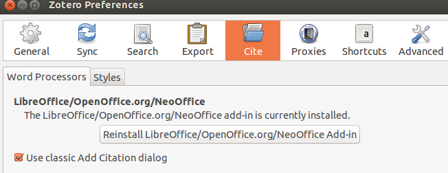

The **Classic View** differs only in the insert/added citation dialog. On clicking "Insert Citation" a window very similar to the left and middle panel of the Zotero library opens. You can click through collections and select an item in the right panel, or use the search box at the top right. Just as in Zotero's quick search, the search offers you to search by "Title, Creator, Year" (the default), "All Tags &amp; Fields" (i.e. everything except attachment full text), and "Everything". Below the library display, you can enter prefix, suffix, and locators.
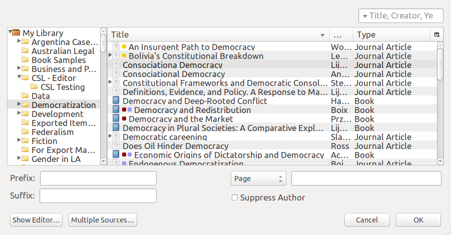
To add multiple items to a single citations, click the "Multiple Source" button. The display changes and a third column appears, showing all items in the citation. Use the green arrows (framed in red in the image below) to add items to the citation or remove them. When the "Keep Sources Cited" option is unselected, you can use the up and down arrows to change the order in the citation.
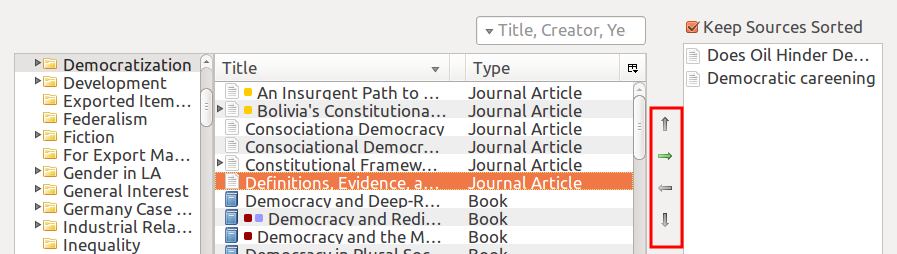
Clicking on "Show Editor" provides a preview of the citation. You can edit a citation in the editor, but it will no longer update in the future, so you should do so only when absolutely necessary.

## RTF/ODF Scan

But what if you want to write in a word processor without a Zotero plugin? Say in *Google Docs* or *Scrivener*. Zotero ODF-Scan is a Zotero plugin that allows you to insert citations markers into any document saved as .odt and then convert those into active Zotero citations. *It requires LibreOffice and the Zotero LibreOffice plugin for selecting a citation style and finalizing citations*.

Download and install the add-on from its [official webpage](http://zotero-odf-scan.github.io/zotero-odf-scan/). In Firefox, click on the "Download Add-on" button. Select "Allow" and then "Install" when prompted. For Zotero Standalone, download the add-on by right-clicking on the "Download Add-on" button and "Save link as..." Then, in Standalone, go to Tools --> Add-ons, click on the little tools icon, and select "Install from File." Browse to the downloaded "rtf-odf-scan-for-zotero.xpi" file and select it. Installation will add a "Scannable Cite" export translator to Zotero and change the "RTF Scan" option to "RTF/ODF Scan."

To use ODF Scan, first set the "Default Output Format" to "Scannable Cite" in the Export tab of the Zotero Preferences. 
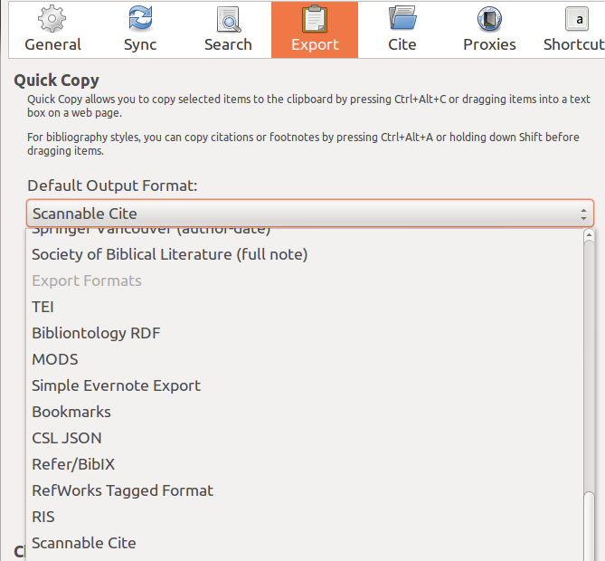

You can now insert citation markers by either draging&dropping items or by using ```ctrl+shift+c``` (```cmd+shift+c``` on Mac) to copy them to your clipboard and the paste them using ctrl/cmd+v or the right-click context menu.
A citation marker will look like this

{ | Smith, (2012) | | |zu:2433:WQVBH98K}

It is separated into five sections by vertical lines. The first section can contain a prefix of the citation. The second section contains author and year of the cited item. The third section can contain a locator such as a page number, the fourth section can contain a suffix for the citation, and the fifth section contains a unique identifier of the item. 
Let's look at this with an example. This marker 

{cf. | Smith, (2012) |ch. 3 |, for the main argument |zu:2433:WQVBH98K}

turns into

(cf. Smith, 2012, chap. 3, for the main argument) when APA is selected as a citation style.

Text in prefixes and suffixes can be formatted in italics or bold using simple mark-up language: To print something in *italics* put a single asterisk (\*) on either side (e.g. \*Weltanschauung\*), to print something bold use two asterisks (e.g. \*\*strongly\*\*)

To suppress the author&mdash;most typically in the case of a parenthetical citation that is preceded by the author name in the text&mdash;put a minus sign (-) in front of the author as in:  

{ | -Smith, (2012) | | |zu:2433:WQVBH98K}

You can set any locator available for Zotero by using standard abbreviations. Note that a space is *required* between locator label and number, i.e. "ch. 6" *not* "ch.6". A full list of locators and their abbreviations can be found as part of the [official instructions](http://zotero-odf-scan.github.io/zotero-odf-scan/). The actual labels printed in your citations depend on your citation style and locale in Zotero.


Once you are done writing and inserting citations, save your document as .odt (Open Document Format-ODF). This is an option in Google Docs 

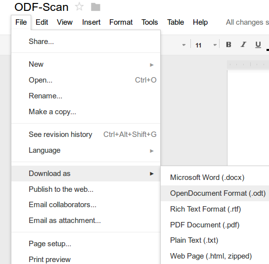

and Scrivener among others. 

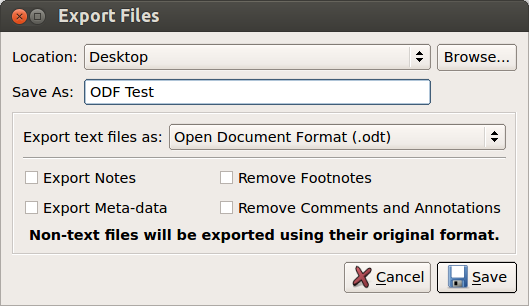	

If your word processing software does not support .odt, you can save the document as .doc or .rtf, open it in LibreOffice and save it as .odt, though this may lead to some losses in formatting.
Then, in Zotero, click on RTF/ODF Scan in the gears/action menu.

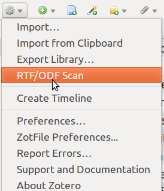 

 Select "ODF (to citations)" as file type and select your saved file as the input and your desired output file.
Click "Next" and the plugin will convert your document.

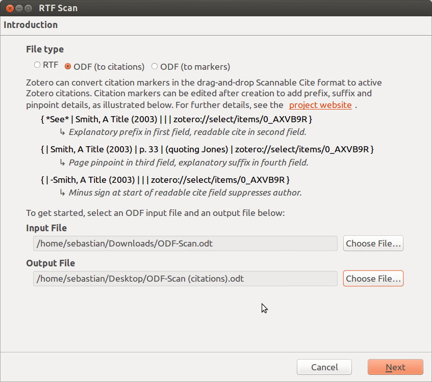

Now open the converted document&mdash;by default it will have (citation) in its file name&mdash;in LibreOffice. In Zotero's LibreOffice plugin toolbar, click on "Set Document Preferences" and choose the desired citation style. Click OK and Zotero will format all references in your document. The citations in the LibreOffice document are now "live"&mdash;they will update to changes in your Zotero database and, if you want to, you can change citation styles or add items to your document as if it had been authored using the LibreOffice plugin all along.

RTF/ODF Scan can also take an existing ODF document with Zotero citations inserted by the LibreOffice plugin and convert citations to markers. This could be useful if you started writing in LibreOffice but want to switch to a word processor without a dedicated Zotero plugin or for writing in a long document, where the LibreOffice plugin can be slow. 
For this option, select ODF (to markers) as File type in the conversion dialog. 

## Other Output options

Zotero and several plugins offer ways to display your items that go beyond citations and bibliographies. In Zotero itself, you have the option to create reports of items that contain all their information in a visually appealing, index-card type format. You can also create an interactive timeline of your entire library or select collections. Beyond the built-in options, there are several visualization plug-ins for Zotero. Of those currently only "Papermachines"  is actively maintained and developed. 

### Reports
Reports contain all the information of an item, including notes, tags, and attachments. They are displayed in a visually appealing format, reminiscent of index cards, that is ideal for printouts.
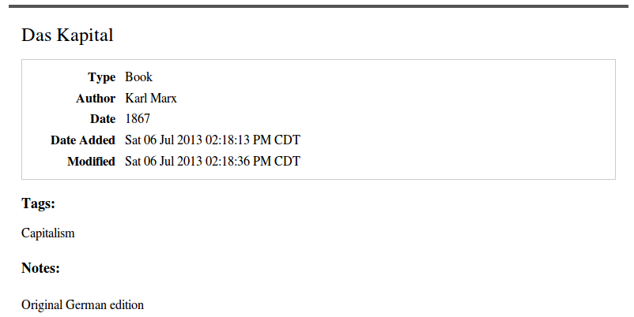

To create a report for an item, right-click on the item in the middle panel and select "Generate Report from Item". You can create reports for multiple items by selecting them (with ```ctrl+click``` or ```shift+click```) and again using right-click --> "Generate Report from Items". Finally, you can right-click on a collection in the left-hand panel and select "Generate Report from Collection". 

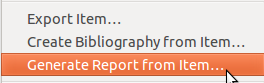

Since the layout of the reports depends on a stylesheet included in Zotero, you will not be 

**ZFF only**: By default, reports sort by their title. In Zotero for Firefox, you can change the sort order of reports by modifying the URL displayed for a report. A generic URL for a report (here of two items) looks like this: ```zotero://report/items/0_6R5DT8XP-0_826FXTJS/html/report.html```. You can add sort parameters after a question mark, such as ```?sort=date```, add multiple sort parameters separated by a comma in the order you want them to apply, and add '/d' after a parameter to change the sort descending. To sort the above report by author and then descending date, for example, you would change the url to ```zotero://report/items/0_6R5DT8XP-0_826FXTJS/html/report.html?sort=firstCreator,date/d```. A full list of possible sort parameters can be found in the [Zotero documentation](http://www.zotero.org/support/reports# sort_order).

**ZFF only** Zotero reports contain all fields of any item and you may find some of these fields of little interest. To customize your reports by removing selected fields, you can use Jason Priem's [Zotero report cleaner](http://jasonpriem.org/projects/report_cleaner.php). First, create the report in Zotero for Firefox. Then view the *page source* by pressing ```ctrl + u``` (Mac: ```cmd + u```), select all and copy. The open the *Report Cleaner* webpage and under step 2. select the fields to *exclude* from the report. E.g. the settings below will print all fields except Date Added, Date Modified, and attachments:

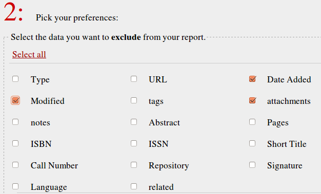

Paste the page source from your reports into the window under 3. on the report cleaner webpage and click ```customize report```. The webpage will now show the cleaned report, which you can save or print.

### Timeline
To create an interactive timeline of any Zotero library or collection, select the library or collection in the left-hand pane and then select "Create Timeline" in the gears menu.

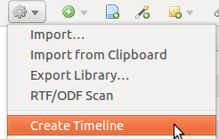

At the top of the screen, your items are placed on three bands. By default the top layer shows items per month, the middle band by years, the bottom band by decades. The white areas in the bottom two bands show the area currently shown in the top band. You can move along the timeline using click &amp; drag or by entering a year into the "Jump to Year" field and pressing ```enter```. Clicking on an item in the top band of the timeline select that item in your Zotero library. 

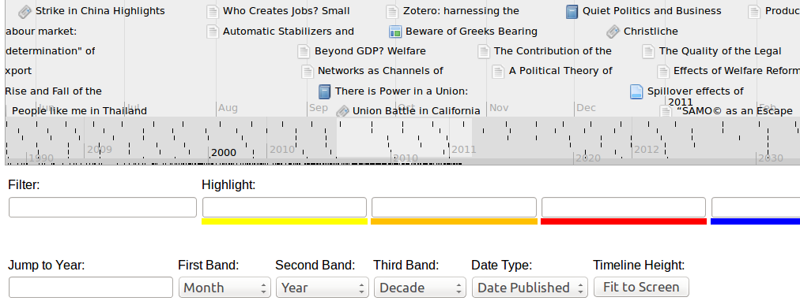

### PaperMachine
