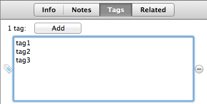
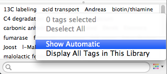

# Chapter Contents
{:.no_toc}

* TOC placeholder
{:toc}

# Tags

With Zotero you can add descriptive keywords, so-called *tags*, to items, files, links and notes. Together with collections, tags can help you organize your Zotero library.

How do tags differ from collections? First, tags in Zotero are not hierarchical, whereas collections can have subcollections. Secondly, tags are more portable than collections: many export formats (like RIS) save your tags, but few support collections.

## Adding Tags

### Adding Tags by Hand

To add a tag to an item, select an item in the center column, and click on the **Tags** tab in the right-hand column. Click the **Add** button, type the desired tag, and press Enter.

To add a tag to a file, link, or note, select one in the center column, and click on its **Tags** field in the right-hand column. This will show a small pop-up, with the same interface as found in the **Tags** tab of items.

To quickly add multiple tags, press `Shift + Enter` when you have selected a tag in the right-hand column. This will expand the field. Copy and paste a list of desired tags into the field, and press `Shift + Enter` again. Zotero will add a tag for each line in the list.

By default, the **Tag Selector** in the left column shows all tags present in the currently selected library or collection. As an alternative way of adding tags, you can drag one or multiple items (or files, links, and notes) from the center column and drop them onto a tag in the **Tag Selector**.

### Automatic Tags

When you save items via a web translator, Zotero automatically saves tags that are attached to that resource. For example, when you save a paper in PubMed, Zotero will automatically save the paper's MeSH (Medical Subject Headings) tags.

If you don't want Zotero to save automatic tags, uncheck the "Automatically tag items with keywords and subject headings" checkbox in the **General** tab of the Zotero preferences.

You can also hide automatic tags from the **Tag Selector** by unchecking the "Show Automatic" option in the **Actions** menu () of the **Tag Selector**.

## Renaming, Deleting, and Merging Tags

To rename a tag of a single item, click on the tag in the right-hand column and change the tag. To rename a tag for your entire library, right-click the tag in the **Tag Selector** (control-click on OS X) and select "Rename Tag...". Change the tag, and click "OK".

To delete a tag of a single item, click on the "minus" button next to the tag in the right-hand column. To delete a tag from your entire library, right-click the tag in the **Tag Selector** (control-click on OS X), select "Delete Tag...", and click "OK".

You can also merge tags. Say you have been using the tags "unread" and "to read" to keep track of papers that you still want to read. To merge these two tags into one, simply rename the "to read" tag to "unread", or vice versa.

## Searching by Tags

After you've diligently tagged everything in your library, it's time for the payoff: you'll be able to quickly find items that have certain tags. So how do you search by tag?

First, you can use the search bar at the top of the center column, which matches against tags if the search mode is set to "All Fields & Tags" or "Everything". You can also search by tag with **Advanced Search**. But the simplest way to filter by tag is to select one or more tags in the **Tag Selector** by clicking on them. This will only show those items in the center column that have the selected tags. You can deselect a tag by clicking it again. To quickly deselect all selected tags, select "Deselect All" in the **Actions** menu () of the **Tag Selector**.

## Searching for Tags

The search box at the bottom of the **Tag Selector** can be used to filter tags in the **Tag Selector**.

By default, the **Tag Selector** only shows those tags that are present in the currently selected library or collection. To always show all the tags in the current library, even when a collection is selected, check the "Display All Tags in This Library" option in the **Actions** menu of the **Tag Selector**.

## Hiding the Tag Selector

If you (temporarily) don't need the **Tag Selector** and rather have more room in the right-hand column for your libraries and collections, you can minimize the **Tag Selector**. To do this, click, or drag down, the divider at the top of the **Tag Selector**. Alternatively, use the **Toggle Tag Selector** shortcut (by default: `Ctrl + Alt + T` (Windows), `Cmd + Shift + T` (OS X)).

## Colored Tags

Colored tags can be even more useful than regular tags. To assign a color to a tag, right-click the tag in the **Tag Selector** (control-click on OS X), and select "Assign Color...". In the pop-up window that opens, select the desired tag color, and click "Set Color". Up to six tags can be assigned colors. To remove a color from a tag, select "Remove Color" in the same pop-up window.

Items that carry colored tags show small colored squares (in the color of the tags) in front of their titles in the center column. Colored tags make it easy to quickly scan a collection or library and see which items have been assigned a certain tag. And since colored tags are grouped together at the top of the **Tag Selector**, they are always within grasp.

Colored tags can be quickly added and removed from items by pressing the number keys 1 through 6. The position of each colored tag in the Tag Selector corresponds to a number key on your keyboard: pressing "1" adds (or removes) the first colored tag to the items selected in the center column, while pressing "2" adds (or removes) the second colored tag, et cetera. The position of colored tags can be changed in the "Assign Color..." pop-up window, by changing the position of each tag. Unlike regular tags, colored tags always show in the **Tag Selector** (when none of the items in the center column carry a colored tag, the tag becomes translucent). So if you forgot the number that belongs to a certain tag, just look at the position of the tag in the **Tag Selector**.
